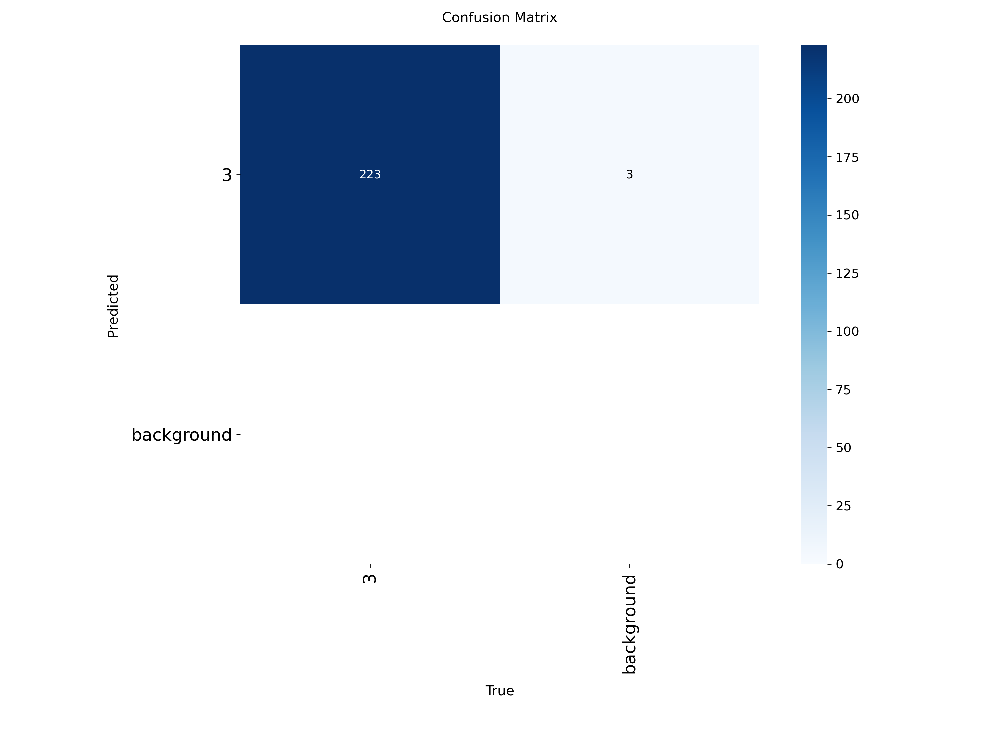
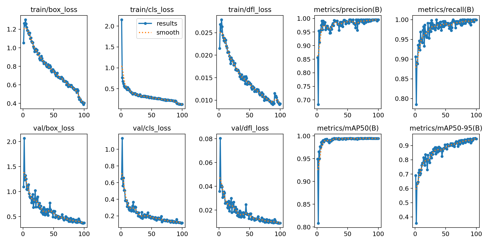
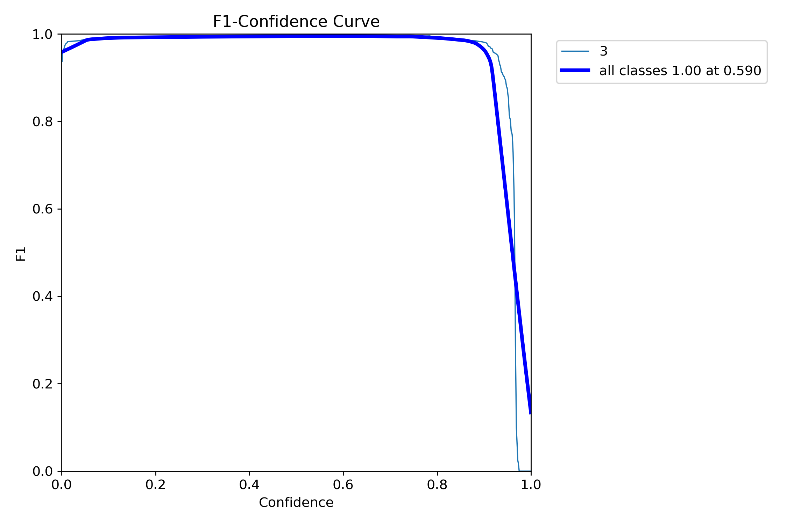

# Stop_Sign_Deep_Learning

---
🛠️ Kullanılan Teknolojiler ve Kütüphaneler
Projenin çalışması için bilgisayarınızda Python yüklü olmalıdır. Gerekli kütüphaneler:

Ultralytics (YOLOv8/v11): Nesne tespiti mimarisi.

OpenCV: Görüntü işleme ve video akışı yönetimi.

PyTorch: Modelin eğitimi için kullanılan derin öğrenme kütüphanesi.

---
Kullanım

Modeli eğitmek:  train.py

Modeli test etmek:  test.py

---
Proje Sonuçları ve Analiz

### 1. Karmaşıklık Matrisi (Confusion Matrix)
Bu tablo, modelin dur levhasını ne kadar doğru bildiğini ve başka nesnelerle karıştırıp karıştırmadığını gösterir.


### 2. Eğitim Metrikleri (Results)
Eğitim süresince hata payının (loss) düşüşünü ve doğruluk oranının (mAP) artışını buradan takip edebilirsiniz.


### 3. F1 ve Hassasiyet Eğrileri



---

## Acknowledgements

This project utilizes the following open-source dataset:

* **Stop Sign Dataset**: Available on [Roboflow Universe](https://universe.roboflow.com/sign-detection-h24ey/stop-sign-h0vwm).

### Citation

If you use this work, please cite the dataset as follows:

```bibtex
@misc{ stop-sign-h0vwm_dataset,
    title = { Stop Sign Dataset },
    type = { Open Source Dataset },
    author = { sign detection },
    howpublished = { \url{ [https://universe.roboflow.com/sign-detection-h24ey/stop-sign-h0vwm](https://universe.roboflow.com/sign-detection-h24ey/stop-sign-h0vwm) } },
    url = { [https://universe.roboflow.com/sign-detection-h24ey/stop-sign-h0vwm](https://universe.roboflow.com/sign-detection-h24ey/stop-sign-h0vwm) },
    journal = { Roboflow Universe },
    publisher = { Roboflow },
    year = { 2023 },
    month = { nov },
    note = { visited on 2026-02-02 },
}
